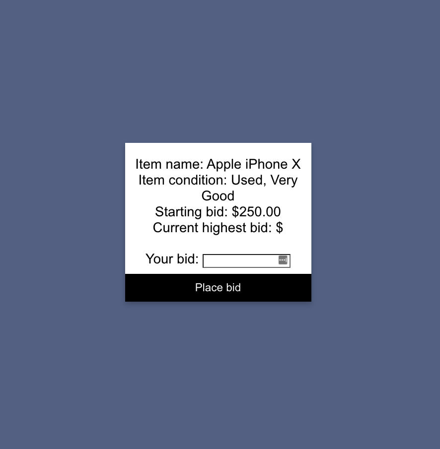

## Instructions for running locally
First, make sure Docker is installed.

Then, to spin up the rest of the project:

`docker-compose build` (first time running project)

`docker-compose up`

## Load auction items
To load the starting set of auction items:

`docker-compose exec api node -r esm scripts/add-starting-auction-items.js`

This will add some "default" auction items to RedisJSON. You only need to do this on the first run of this project.

## Testing bidding
For demo purposes, the bidding is hardcoded to end 30 seconds after the API starts/restarts. If you are playing around with the app and developing locally, you may need to restart the API to reset the timer:

`docker-compose restart api`

## Application Architecture

## Using the bidding app
To use the app and bid on an item, enter a bid into the input box and submit. If you submit without entering anything you will get a validation error on the UI. Also, if the value you enter is not higher than the current highest bid, the bid will not be entered and you will get a validation error.

